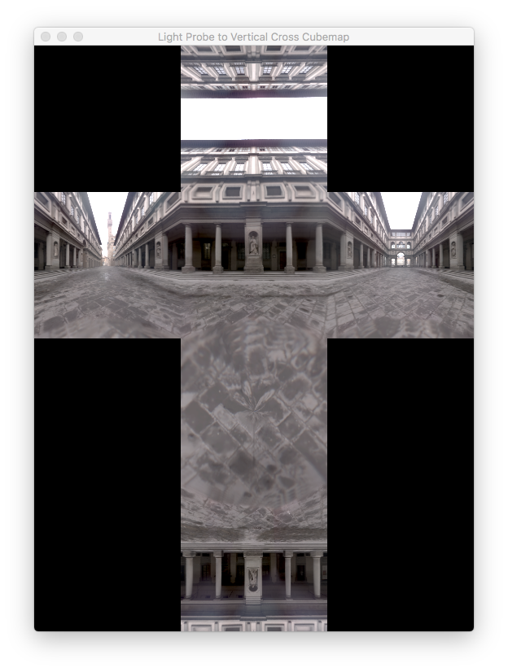
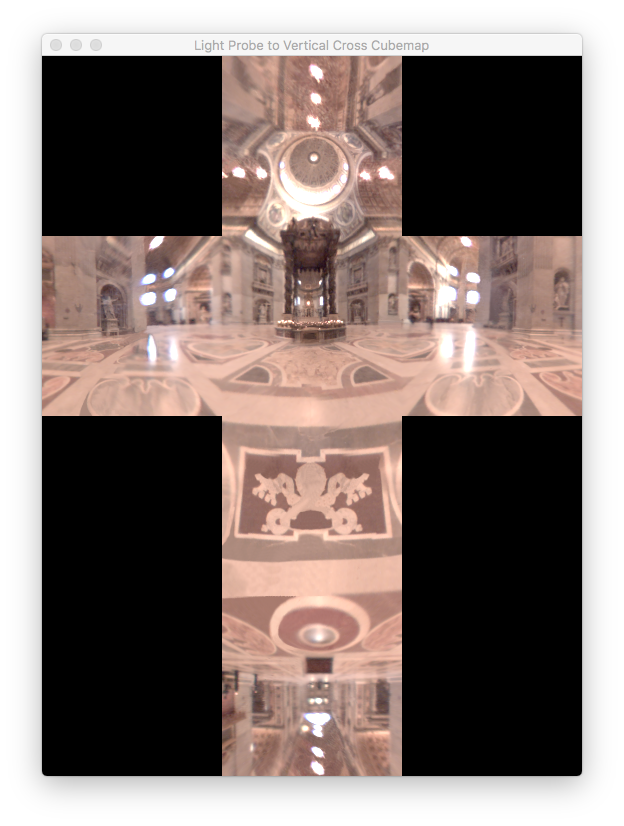

## Converting Light probes to Vertical Crossmaps

This project will convert light probes images to vertical cross cubemaps. The source can also be modified to render a skybox.

<br />
<br />

The concept of the conversion is simple. Basically, the Mathematics requires a 3D vector to be converted in a pair of uv coordinates which is then used to access the 2D Light Probe image.

According to the documentation (see below - angmap.cal), the calculations looks like this :

```glsl

    float norm = 1.0/sqrt(Px * Px + Py * Py + Pz * Pz);

```

where P is a 3D vector in world space with the components Px, Py and Pz and norm is the inverse of its magnitude.

```glsl

    float DDx = Px * norm;
    float DDy = Py * norm;
    float DDz = Pz * norm;

```

DDx, DDy and DDz are the components of the normalized P vector.

The radius is calculated as:

```glsl

    float r = (1/(2*PI)) * acos(DDz)/sqrt(DDx * DDx + DDy * DDy);
```

Finally, the texture coordinates are computed:

```glsl
    float sb_u = 0.5 + DDx * r;
    float sb_v = 0.5 + DDx * r;
```

The values of sb_u and sb_v are used to access the texture instantiated from the Light Probe image.


It is obvious from the code above, a normalized 3D vector is required to calculate the quantities: *r*, *sb_u* and *sb_v*.

One method is to send an interpolated 3D vector from the vertex shader to the fragment shader.  This is a commonly used idea whenever one needs to render a skybox as a background of a scene. It can also be used to render a 2D texture to each of the six faces of a cubemap texture. The six 2D textures are created by placing a virtual camera at the centre of a cube (of 2 units) with a 90-degree FoV and setting up its orientation to capture the view while facing the 6 faces of the cube viz. right, left, top, bottom, front and back. 

Another method is to output an equirectangular texture since we know how to project a 2D point on the (equirectangular) map onto a unit sphere.

This demo chooses the first method which is to output an intermediate cubemap texture consisting of six 2D textures. A framebuffer object is instantiated to capture the cubemap texture. Once the cubemap texture had been captured, one can map it to a vertical/horizontal cross map, a vertical/horizontal strip or an equirectangular map. There is also an additional advantage: one can use macOS' *OpenGL Profiler* to check if the cubemap texture has been successfully created because the code creating its six 2D textures is proven  to work.

Paul Debevec had spent a lot of time and effort developing the concept of light probe images to be used in Image-Based Lighting (IBL). These images are actually of a record of the 3D environment of a real-world scene. He has posted a number of High Dynamic Range (HDR) Light Probe images as well as vertical crossmaps of those images at his site. (See links below.)

Mapping the six 2D textures to a vertical cross map is relatively straighforward. We choose to map OpenGL's texture coordinate system with the range [0.0, 1.0] to a rectangular grid of dimensions 3 x 4 units squared. The source code of the fragment shader *VertCrossFragmentShader.glsl* has been heavily commented to help the reader better understand the mapping details.

The horizontal axis of the coordinate system of this grid has the range [0.0, 3.0] while the range of its vertical axis is [0.0, 4.0]. Given below is a table of values of the coordinates of the 6 faces of the vertical cross map expressed in the 2D coordinate system of the grid. (Recall OpenGL's texture coordinate system has its origin at the bottom left). The origin of this grid is at the bottom left.


| Face  |   Bottom Left   |   Bottom Right  | Top Right | Top Left  |
| :---: | :---: | :---:|:---:|:---:|
|   +X  | (2.0, 2.0) | (3.0, 2.0) | (3.0, 3.0) | (2.0, 3.0) |
|   -X  | (0.0, 2.0) | (1.0, 2.0) | (1.0, 3.0) | (0.0, 3.0) |
|   +Y  | (1.0, 3.0) | (2.0, 3.0) | (2.0, 4.0) | (1.0, 4.0) |
|   -Y  | (1.0, 1.0) | (2.0, 1.0) | (2.0, 2.0) | (1.0, 2.0) |
|   +Z  | (1.0, 2.0) | (2.0, 2.0) | (2.0, 3.0) | (1.0, 3.0) |
|   -Z  | (1.0, 0.0) | (2.0, 0.0) | (2.0, 1.0) | (1.0, 1.0) | 

<br />
<br />
<br />

Expected output using UffiziProbe.hdr:

<p align="center">
  
</p>

**<p align="center" >Uffizi Plaza</p>**

Expected output using StPetersProbe.hdr:

<p align="center">
  
</p>


**<p align="center" >St Peter's Basilica</p>**

<br />
<br />
<br />

## *Notes*

A)

OpenGL's texture coordinates in NDC space are always in the range [0.0, 1.0] for both the u- and v-axes. Before the rendered vertical cross cubemap can be saved as an HDR image, scaling should be done.
The display of this demo looks like a vertical cross because the dimensions of the view had been set using XCode's Interface Builder to 540 pixels : 720 pixels = 3 : 4.

The  Objective-C class, CIImage has an init method:

```objective-c

    initWithTexture:size:flipped:colorSpace:

```

which can be use for this purpose. It requires a texture ID and the texture's resolution.

<br />

B)

The code below was downloaded using the link: https://www.pauldebevec.com/RNL/Source/angmap.cal

{
angmap.cal

Convert from directions in the world to coordinates on the angular sphere image

-z is forward (outer edge of sphere)
<br />
+z is backward (center of sphere)
<br />
+y is up (toward top of sphere)
<br />
}

<br />
sb_u = 0.5 + DDx * r;
<br />
sb_v = 0.5 + DDy * r;
<br />
<br />
r = 0.159154943 * acos(DDz)/sqrt(DDx * DDx + DDy * DDy);
<br />
<br />
DDy = Py * norm;
<br />
DDx = Px * norm;
<br />
DDz = Pz * norm;
<br />
<br />
norm = 1/sqrt(Py * Py + Px * Px + Pz * Pz); 


### KIV: 

Further improvements:
<br />
Code to convert the intermediate cubemap texture to an equirectangular image can added.
<br />
Code to convert a light probe image to an equirectangular image directly maybe spin off as a separate project.

<br />
<br />
<br />

### Web Links:

https://www.pauldebevec.com/Probes/

https://www.pauldebevec.com/RNL/Source/

https://vgl.ict.usc.edu/Data/HighResProbes/

https://www.gamedev.net/forums/topic/324884-hdr-angular-maps/

https://en.wikipedia.org/wiki/Cube_mapping

<br />
<br />

### Developed with XCode 9.4.1

<br />

### Runtime requirements:

<br />

>macOS OpenGL 3.2

or

>iOS OpenGL ES 3.0


